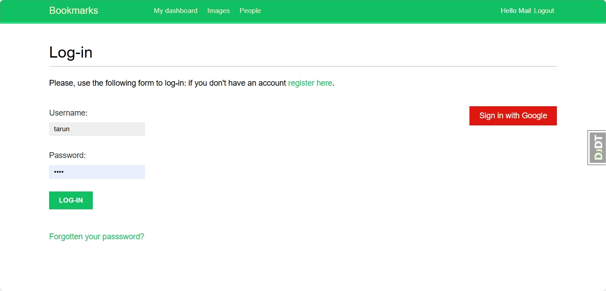

---

# Socially

Socially is a Django-based social media platform that integrates various third-party authentication methods using **social-auth-app-django** and features user profiles with image handling powered by **easy-thumbnails**. The project also leverages Redis for task management, Celery for background processing, and Stripe for payment processing. 





## Features
- User authentication with popular social media platforms (using **social-auth-app-django**).
- User profile management, including profile pictures (via **easy-thumbnails**).
- Redis and Celery for asynchronous task handling.
- Django Debug Toolbar for performance profiling.
- Environment variables management using **python-decouple**.

## Requirements

Ensure you have the following dependencies installed before running the project:

```plaintext
asgiref==3.8.1
certifi==2024.7.4
cffi==1.16.0
charset-normalizer==3.3.2
cryptography==42.0.8
defusedxml==0.8.0rc2
Django==5.0.6
django-debug-toolbar==4.3.0
django-extensions==3.2.3
easy-thumbnails==2.8.5
idna==3.7
MarkupSafe==2.1.5
oauthlib==3.2.2
pillow==10.3.0
pycparser==2.22
PyJWT==2.8.0
pyOpenSSL==24.1.0
python-decouple==3.8
python3-openid==3.2.0
redis==5.0.4
requests==2.31.0
requests-oauthlib==2.0.0
social-auth-app-django==5.4.0
social-auth-core==4.5.4
sqlparse==0.5.0
tzdata==2024.1
urllib3==2.2.2
Werkzeug==3.0.2
```

## Installation

1. **Clone the repository**:
   ```bash
   git clone https://github.com/your-username/socially.git
   cd socially
   ```

2. **Create a virtual environment** and activate it:
   ```bash
   python3 -m venv env
   source env/bin/activate
   ```

3. **Install the dependencies** from `requirements.txt`:
   ```bash
   pip install -r requirements.txt
   ```

4. **Set up environment variables**:
   - Add your secret keys, database configuration, and other sensitive data to the `.env` file.

5. **Run migrations**:
   ```bash
   python manage.py migrate
   ```

6. **Run the development server**:
   ```bash
   python manage.py runserver
   ```

## Usage

- Visit `http://127.0.0.1:8000/` in your browser to access the project.
- You can log in using various google account, upload profile picture, and manage your account.


## Third-Party Services

- **Social Authentication**: Uses `social-auth-app-django` to handle third-party authentication (Google, Facebook, etc.).
- **Redis & Celery**: Used for background task handling.
- **Stripe**: Stripe is for payment processing. 
